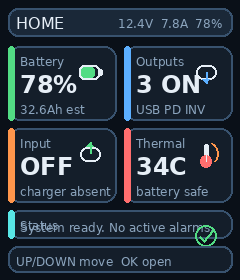
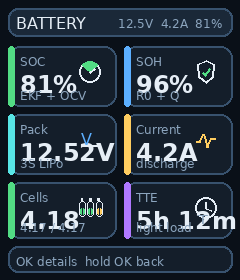
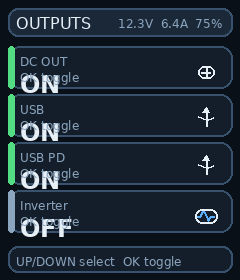
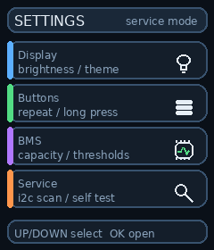

# Pico PowerStation C

Raspberry Pi Pico / RP2040 firmware for a portable power station with battery monitoring, protection logic, ST7789 UI, and a modular C/C++ codebase.

The project includes:

- BMS logic with SOC/SOH estimation
- sensor and peripheral drivers for the RP2040 platform
- a 240x280 ST7789-based UI
- auxiliary build targets for display and pinout smoke tests

## UI Preview

The screenshots below use the latest UI images currently available in this repository.

<p align="center">
  
  
</p>

<p align="center">
  
  
</p>

## Highlights

- Dual-core layout: Core0 handles sensing, BMS logic, protection, and UI polling; Core1 is used for display work.
- Modular source tree split into `drivers`, `bms`, and `app`.
- ST7789 display pipeline with DMA-oriented rendering flow.
- Support for both the main firmware image and small standalone hardware tests.

## Hardware Stack

- Raspberry Pi Pico / RP2040
- ST7789 240x280 display
- TCA9548A I2C multiplexer
- INA226 current / voltage monitors
- INA3221 multi-channel cell monitor
- LM75A temperature sensors

## Repository Layout

```text
pico_powerstation_c/
|- CMakeLists.txt
|- pico_sdk_import.cmake
|- memmap_16mb.ld
|- src/
|  |- app/          application logic, UI, power control, protection, buzzer
|  |- bms/          battery algorithms, prediction, logging, flash NVM
|  |- drivers/      hardware drivers
|  `- third_party/  ST7789 support library
|- ui_assets/       PNG assets, RGB565 headers, previews
|- tmp/pdfs/        helper script for PDF generation
`- BUILD.md         detailed build notes
```

## Main Targets

- `pico_powerstation` - main firmware target
- `periph_test_new_pinout` - peripheral smoke test for the new pinout
- `main_cpp_display_test` - ST7789 display smoke test

## Build

Requirements:

- Raspberry Pi Pico SDK 2.x
- CMake 3.13+
- ARM GCC toolchain (`arm-none-eabi-gcc`)
- Python 3 for Pico SDK scripts

Typical build flow:

```bash
git clone https://github.com/rslsl/pico_powerstation_c.git
cd pico_powerstation_c

# Make sure PICO_SDK_PATH points to your pico-sdk checkout
mkdir build
cd build
cmake .. -DCMAKE_BUILD_TYPE=Release
cmake --build . -j
```

Primary output:

```text
build/pico_powerstation.uf2
```

For more detailed notes, flash layout details, and build guidance, see `BUILD.md`.

## Notes

- The repository tracks source code and UI assets, while generated build outputs are ignored.
- `memmap_16mb.ld` is available for 16 MB flash builds when needed.
