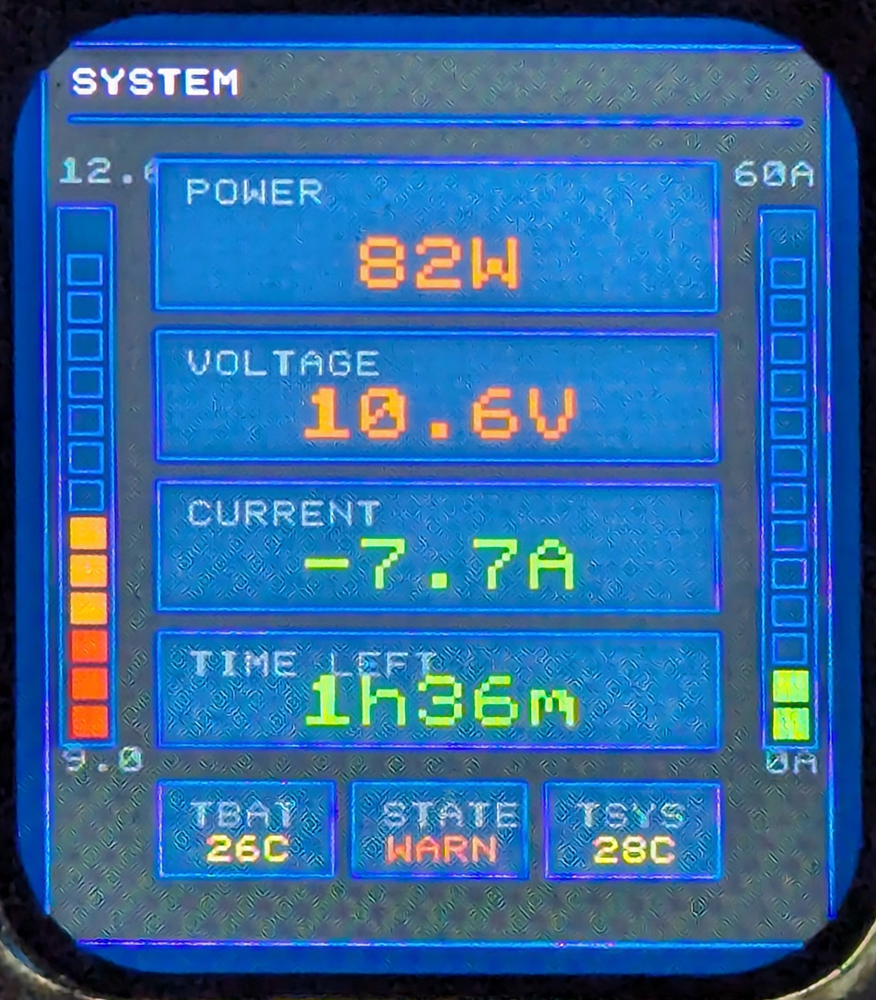
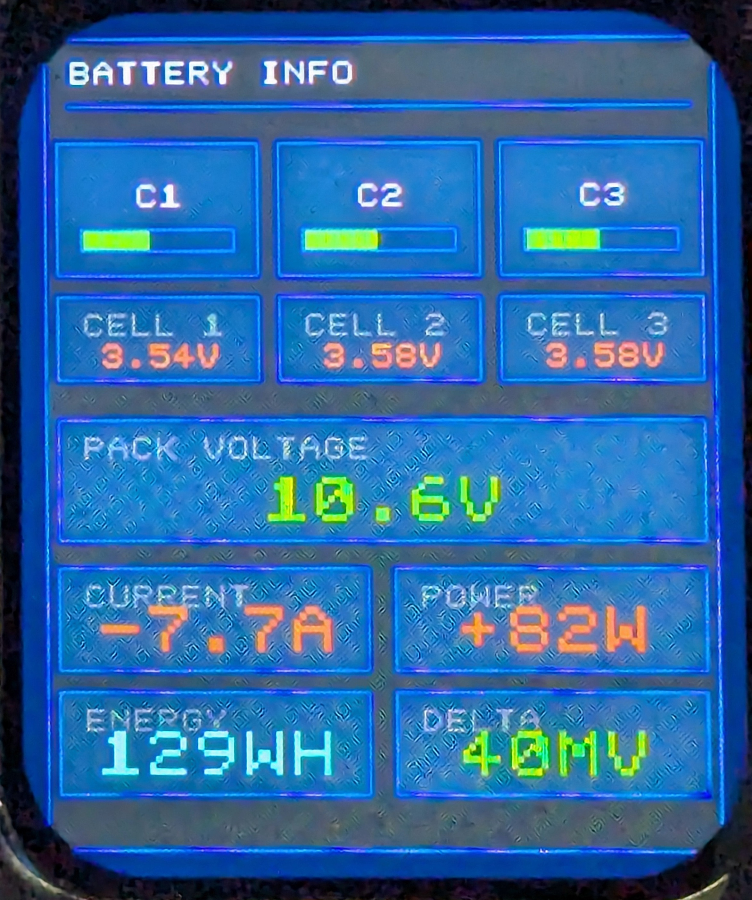
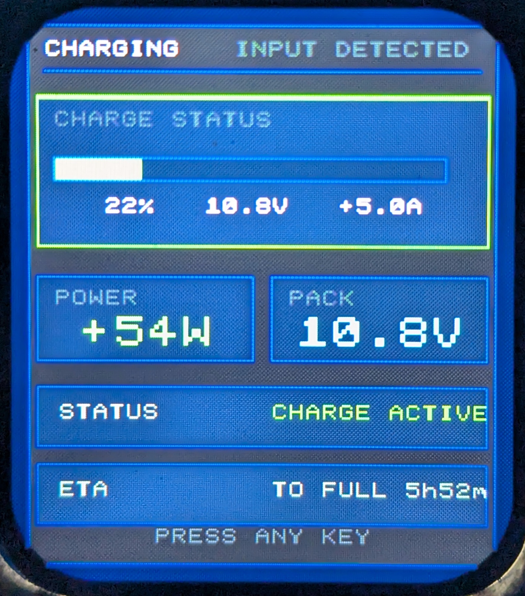

# PowerStation OTA ESP

[Українська](#українська) | [English](#english)

## Interface Screens

### Home / System



### Battery Info



### Charging



## Українська

`PowerStation OTA ESP` — це актуальний репозиторій прошивки для системи на `RP2040 / Pico` + `ESP32-S2`.

Поточна архітектура:

- `loader`
- `slot A = recovery`
- `slot B = main`

### Що робить система

Pico:

- читає датчики струму, напруги, температури й осередків
- виконує BMS-логіку, захисти, керування виходами та сесіями
- веде статистику, налаштування й event log у flash
- керує локальним UI на ST7789
- приймає OTA-оновлення в `slot B`

ESP32-S2 bridge:

- спілкується з Pico по UART
- піднімає web UI і сторінку Pico OTA
- кешує telemetry, stats, settings, ota state і slices event log
- підтримує OTA для себе
- приймає `pico_powerstation_slot_b.bin`, зберігає його в SPIFFS і передає в Pico
- синхронізує час через NTP і передає epoch у Pico

### Основні робочі папки

- `src/` — активний код Pico / RP2040
- `esp32_s2_bridge/` — активний код ESP32-S2
- `OTA_ready/` — актуальні готові файли для прошивки
- `docs/` — документація
- `tools/` — скрипти для combined UF2

### Актуальні артефакти

- `OTA_ready/combined_loader_recovery_main.uf2` — повна Pico-прошивка для відновлення
- `OTA_ready/pico_powerstation_slot_b.bin` — OTA-оновлення Pico main slot
- `OTA_ready/esp32_s2_bridge.bin` — актуальна прошивка ESP32-S2 bridge

### Швидкий старт

Збірка Pico:

```bash
cmake -S . -B build -G Ninja -DCMAKE_BUILD_TYPE=Release
cmake --build build --config Release
```

Збірка ESP:

```bash
cd esp32_s2_bridge
python -m platformio run
```

### Основні файли для змін

Pico:

- `src/main.c`
- `src/main_ota_loader.c`
- `src/config.h`
- `src/app/ui.c`
- `src/app/esp_manager.c`
- `src/app/ota_manager.c`
- `src/bms/battery.c`
- `src/bms/bms_logger.c`

ESP:

- `esp32_s2_bridge/src/main.cpp`
- `esp32_s2_bridge/src/web_ui.h`
- `esp32_s2_bridge/src/pico_ota_ui.h`

### Де читати далі

- `BUILD.md` — повна інструкція зі збірки
- `PROJECT_STRUCTURE.md` — швидка карта файлів
- `docs/FLASHING_GUIDE_UK.md` — інструкція з прошивки
- `docs/CODE_DESCRIPTION_UK.md` — опис системи
- `workplan.md` — поточний контекст і внесені зміни

## English

`PowerStation OTA ESP` is the current firmware repository for the `RP2040 / Pico` + `ESP32-S2` system.

Current runtime architecture:

- `loader`
- `slot A = recovery`
- `slot B = main`

### What the system does

Pico:

- reads current, voltage, temperature, and cell telemetry
- runs BMS, protection, output control, and session logic
- stores settings, stats, and event log data in flash
- drives the local ST7789 UI
- receives OTA updates into `slot B`

ESP32-S2 bridge:

- communicates with Pico over UART
- serves the web dashboard and Pico OTA page
- caches telemetry, stats, settings, OTA state, and event log slices
- supports OTA for the ESP itself
- accepts `pico_powerstation_slot_b.bin`, stages it in SPIFFS, and transfers it to Pico
- syncs time via NTP and forwards epoch time to Pico

### Main working folders

- `src/` - active Pico / RP2040 code
- `esp32_s2_bridge/` - active ESP32-S2 bridge code
- `OTA_ready/` - current ready-to-flash artifacts
- `docs/` - documentation
- `tools/` - helper scripts for combined UF2 generation

### Current artifacts

- `OTA_ready/combined_loader_recovery_main.uf2` - full Pico recovery image
- `OTA_ready/pico_powerstation_slot_b.bin` - Pico OTA image for the main slot
- `OTA_ready/esp32_s2_bridge.bin` - current ESP32-S2 bridge firmware

### Quick start

Build Pico:

```bash
cmake -S . -B build -G Ninja -DCMAKE_BUILD_TYPE=Release
cmake --build build --config Release
```

Build ESP:

```bash
cd esp32_s2_bridge
python -m platformio run
```

### Main files to edit

Pico:

- `src/main.c`
- `src/main_ota_loader.c`
- `src/config.h`
- `src/app/ui.c`
- `src/app/esp_manager.c`
- `src/app/ota_manager.c`
- `src/bms/battery.c`
- `src/bms/bms_logger.c`

ESP:

- `esp32_s2_bridge/src/main.cpp`
- `esp32_s2_bridge/src/web_ui.h`
- `esp32_s2_bridge/src/pico_ota_ui.h`

### Read next

- `BUILD.md` - full build guide
- `PROJECT_STRUCTURE.md` - quick file map
- `docs/FLASHING_GUIDE_EN.md` - flashing guide
- `docs/CODE_DESCRIPTION_EN.md` - system description
- `workplan.md` - current context and recent changes

## Notes

- `pico_powerstation` still builds as a monolithic image, but the working OTA architecture is `loader + slot A + slot B`.
- Event Log transport currently uses UART slices, with Pico reporting the actual transmitted row count and ESP requesting batches of `8`.
- `POWERSTATION_FLASH_16MB` still exists as a build option in `CMakeLists.txt`, but the current active deployment flow is based on the working 2 MB layout and the artifacts in `OTA_ready/`.
